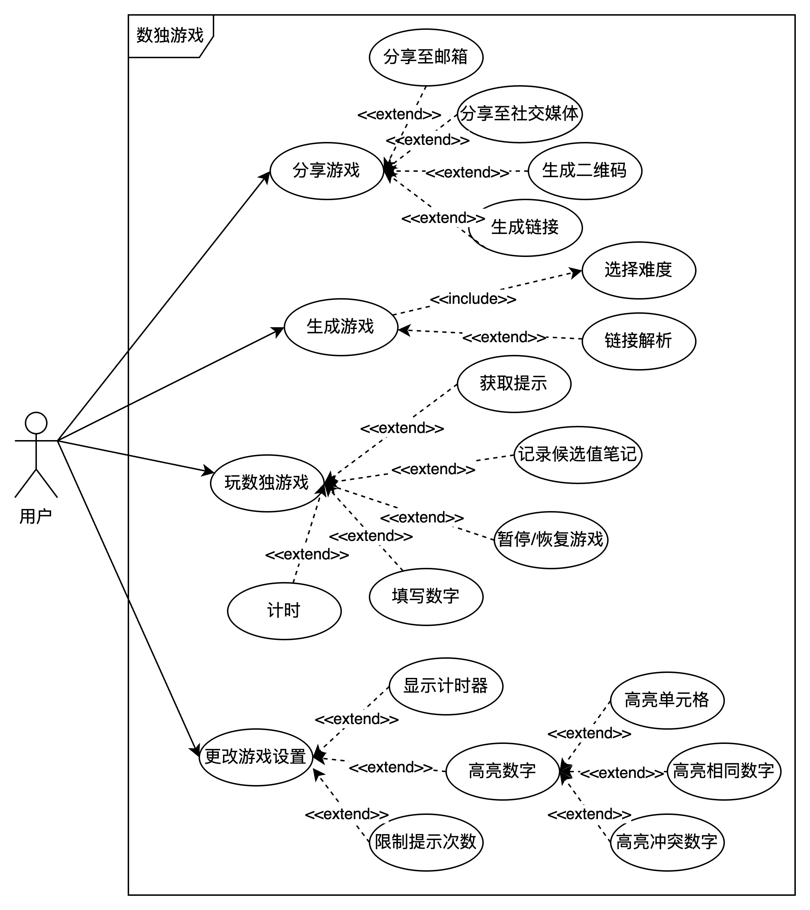
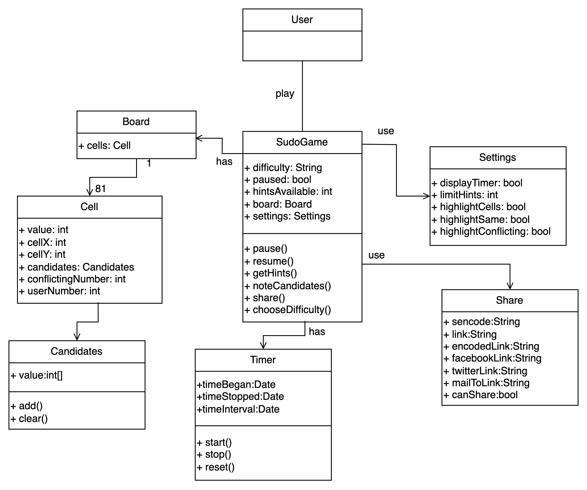
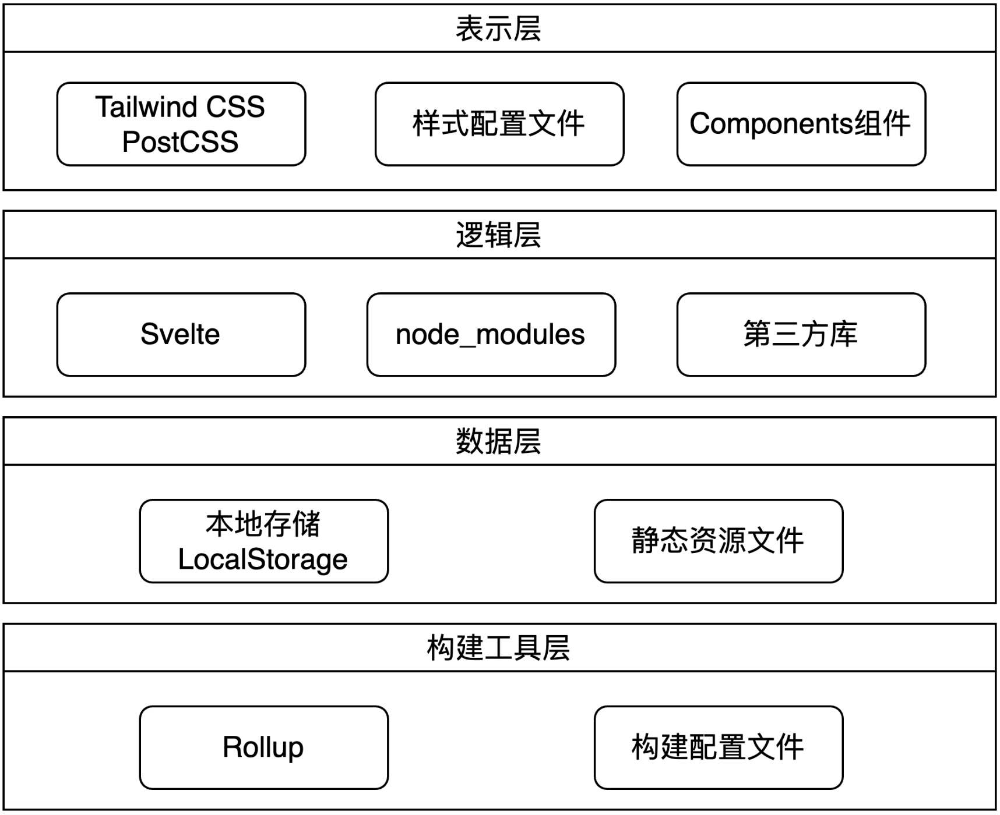
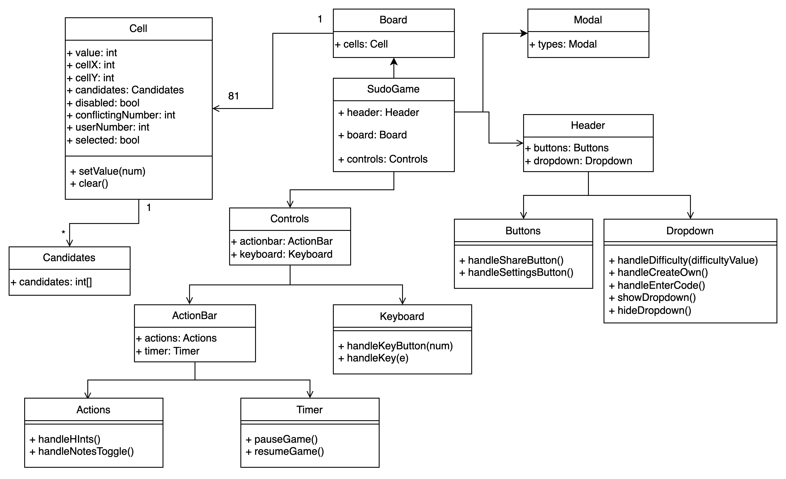

# 一、需求规格

## 1.1 愿景

该项目的愿景是创建一个功能丰富、用户友好的在线数独游戏平台，允许用户选择、解决和分享数独谜题。通过先进的技术实现，提供直观的用户界面以及流畅的用户体验，项目希望为数独爱好者提供一个全面的在线数独体验平台。项目提供的核心功能包括：

（1）**数独游戏**：提供9×9的经典的数独游戏玩法，支持用户提示、在单元格记录候选值笔记，以及游戏的暂停/恢复等功能。用户可以通过实体键盘或虚拟键盘输入数字，系统会在每次输入后立即检查并提示是否存在与当前单元内已有数字的冲突。

（2）**难度选择**：可以让用户选择不同难度级别的谜题，如Very Easy，Easy，Medium，Hard。

（3）**分享功能**：用户可以通过链接、社交媒体或二维码分享数独谜题。

（4）**设置和个性化**：提供丰富的设置选项，允许用户自定义游戏体验，如显示计时器、限制提示数量和高亮相同数字等。

## 1.2 用例分析

该项目的用例大致包括如下：

#### （1）用例名称：分享游戏

- **主要参与者**：用户
- **目标**：保存并分享游戏
- **基本流程**：
  1. 用户点击分享按钮。
  2. 系统会生成一个分享链接和分享二维码。
  3. 用户可以将链接或二维码分享到社交媒体或邮箱。

#### （2）用例名称：生成数独题目

- **主要参与者**：用户
- **目标**：为用户生成不同难度的数独题目
- **基本流程**：
  1. 用户从Very Easy，Easy，Medium，Hard中选择难度，或者通过分享链接解析数独题目URL并导入。
  2. 系统根据用户选择生成一个新的数独题目。
  3. 用户开始游戏。

#### （3）用例名称：玩数独游戏

- **主要参与者**：用户
- **目标**：用户能在提供的数独界面上完成游戏
- **基本流程**：
  1. 计时器开始计时，用户选择一个单元格进行填写。
  2. 用户可以填写候选值或直接填写自己的答案。
  3. 游戏进行期间，用户可以暂停/恢复游戏。

#### （4）用例名称：更游戏设置

- **主要参与者**：用户
- **目标**：调整游戏相关设置
- **基本流程**：
  1. 用户点击“设置”按钮进入设置界面。
  2. 用户可以自定义更改游戏设置，包括是否显示计时器、限制提示次数、高亮数字（如高亮单元格、高亮相同数字、高亮冲突数字）。
  3. 用户保存设置并返回游戏界面。

## 1.3 领域模型

该领域模型展示了用户`User`与数独游戏`SudoGame`，以及数独游戏`SudoGame`与其他组件之间的关系。用户`User`可以玩数独游戏`SudoGame`，数独游戏`SudoGame`含有难度、可用提示数量等属性，用户可以选择难度和分享游戏，也可以获取提示、在单元格记录候选值笔记以及暂停/恢复游戏。数独游戏`SudoGame`含有一个单元格板`Board`，该单元格板含有81个单元格`Cell`（9x9布局），每个`Cell`都有一个候选值`Candidates`组件保存候选值，数独游戏`SudoGame`还含有计时器`Timer`组件用于游戏计时。此外，数独游戏`SudoGame`可以使用设置组件`Settings`对游戏默认设置进行修改，数独游戏`SudoGame`也可以使用分享组件`Share`进行游戏分享。

# 二、软件设计规格

## 2.1 系统技术架构

系统技术架构主要包含四个部分：

1. **构建工具层**
   - **Rollup**：使用 `Rollup` 作为项目的构建工具，负责将JavaScript模块打包成单个文件，提高加载性能。
   - **构建配置文件**：`rollup.config.js` 文件定义了Rollup的构建配置，包括输入文件、输出配置、插件等。
2. **数据层**
   - **本地存储LocalStorage**：存储数独题目、游戏状态和用户设置。
   - **静态资源文件**：静态资源文件存储在 `static` 目录下，如 manifest.json ，用于配置Web应用的启动页面和其他元数据。
3. **逻辑层**
   - **Svelte**：使用Svelte框架开发前端应用，提供状态管理和响应式数据绑定，提高开发效率和用户体验。
   - **node_modules**：处理核心业务逻辑，与数据层和表示层交互，为表示层提供逻辑支持。
   - **第三方库**：
     - `@mattflow/sudoku-solver`：用于解决数独谜题的算法库。
     - `fake-sudoku-puzzle-generator`：用于生成虚假的数独谜题。
4. **表示层**
   - **Tailwind CSS、PostCSS**：使用Tailwind CSS作为项目的样式框架，提供了一套实用的工具类，方便快速设计和开发响应式布局。PostCSS配合 `autoprefixer` 和 `postcss-clean` 等插件，自动添加浏览器前缀和清理无用CSS代码。
   - **样式配置文件**：`tailwind.config.js` 文件用于自定义Tailwind CSS的配置，如颜色、间距、字体大小等。
   - **Components组件**：提供用户界面，如数独游戏网格、候选值填写按钮、计时器、提示按钮等，与用户交互。

## 2.2 对象模型

该对象模型图展示了项目中的主要对象及其关系。`SudoGame`类是代表整体游戏，其包含 `Board`、`Controls`和`Header` 。`Board` 类表示游戏的棋盘，包含多个单元格 `Cell`，每个 `Cell` 可以有多个候选值 `Candidates`。控制类`Controls` 包含 `ActionBar` 和 `Keyboard`，其中 `ActionBar`中的`Actions`主要用于实现游戏提示和记录候选值笔记这两个操作，`ActionBar`中的`Timer`主要用于控制游戏的暂停和恢复，而`Keyboard`主要负责用户的键盘输入。`Header`类 包含`Buttons`和`Dropdown`，`Buttons`负责点击后分享游戏和修改游戏默认设置，`Dropdown`用于负责下拉后进行游戏难度的选择以及创建自定义游戏。

具体分析如下：

- **SudoGame**

  - **描述**：`SudoGame`为数独游戏的整体管理类。

  - **属性**：
    - `header`：表示游戏头部，包含按钮和下拉菜单。
    - `board`：表示数独棋盘部分。
    - `controls`：表示控制区域，包括计时器和按钮功能。

- **Board**

  - **描述**：`Board`由多个单元格`Cell`组成，表示整个数独棋盘。
  - **属性**：
    - `cells`：包含81个`Cell`对象的集合。

- **Cell**
  - **描述**：`Cell`表示数独棋盘上的一个单元格，包含数值和状态属性，支持值的设置和清空操作。
  - **属性**：
    - `value`：单元格的数值。
    - `cellX`：单元格的横坐标。
    - `cellY`：单元格的纵坐标。
    - `candidates`：候选值集合，类型为`Candidates`。
    - `disabled`：布尔值，指示单元格是否不可编辑。
    - `conflictingNumber`：当前单元格存在冲突时的数值。
    - `usernumber`：用户输入的数值。
    - `selected`：布尔值，是否选中。
  - **方法**：
    - `setValue(pos, num)`：设置单元格的值。
    - `clear()`：清空单元格内容。
- **Candidates**
  - **描述**：`Candidates`用于管理单元格的候选值集合，支持动态更新和显示。
  - **属性**：
    - `candidates`：存储候选值的数组。
- **Controls **
  - **描述**：`Controls`管理游戏的操作部分，包括动作栏、键盘输入和计时器。
  - **属性**：
    - `actionbar`：动作栏，包含主要的功能按钮（如暂停、提示）。
    - `keyboard`：虚拟键盘，用于用户输入。
    - `Timer`：计时器类，显示游戏时间。
- **ActionBar**
  - **描述**：`ActionBar`为用户提供主要操作功能按钮的实现。
  - **属性**：
    - `actions`：动作按钮集合（由`Actions`类提供）。
    - `timer`：计时器对象。
- **Actions**
  - **描述**：`Actions`封装了用户操作的具体实现，如提示和暂停功能。
  - **方法**：
    - `handleHints()`：提供提示功能。
    - `handleNotesToggle()`：启用/关闭候选值功能。
- **Timer**
  - **描述**：`Timer`显示游戏时长，支持暂停与恢复操作。
  - **方法**：
    - `pauseGame()`：暂停计时器。
    - `resumeGame()`：恢复计时器。
- **Keyboard**
  - **描述**：`Keyboard`支持用户通过键盘输入数值或移动光标。
  - **方法**：
    - `handleKeyButton(num)`：处理数字键输入。
    - `handleKey(e)`：处理键盘事件。
- **Header**
  - **描述**：`Header`类为游戏头部，包含分享按钮和设置菜单等功能。
  - **属性**：
    - `buttons`：头部的按钮，支持分享和设置。
    - `dropdown`：下拉菜单，支持难度选择、自定义题目输入等功能。

- **Buttons**
  - **描述**：`Buttons`实现分享和设置功能按钮的操作。
  - **方法**：
    - `handleShareButton()`：生成分享链接或二维码。
    - `handleSettingsButton()`：打开设置界面。
- **Dropdown**
  - **描述**：`Dropdown`实现难度选择、自定义题目等功能的下拉菜单操作。
  - **方法**：
    - `handleDifficulty(difficultyValue)`：设置游戏难度。
    - `handleCreateOwn()`：创建自定义题目。
    - `handleEnterCode()`：解析用户输入的题目编码。
    - `showDropdown()`：展示下拉菜单。
    - `hideDropdown()`：隐藏下拉菜单。

## 2.3 设计改进建议

优点：

1. **模块化设计**：项目结构清晰，组件划分合理，便于维护和扩展。例如，components目录下的各个子目录（如 `Board`, `Controls`, `Header`, `Modal` 等）分别对应不同的功能模块。
2. **状态管理**：使用 Svelte 的 `store` 来管理全局状态，如 `timer`, `gamePaused`, `settings`等，确保了状态的一致性和可维护性。
3. **样式管理**：使用 TailwindCSS 进行样式管理，简化了样式的编写和维护，提高了开发效率。
4. **响应式设计**：使用 TailwindCSS 的响应式工具类，使得应用在不同设备上都能有良好的显示效果。
5. **组件复用**：通过组件化设计，实现了代码的复用。例如，`Switch` 组件在多个地方使用，减少了重复代码。

缺点：

1. **组件间耦合度高**：部分组件之间的耦合度较高，可能导致某些组件的修改会影响到其他组件。例如，在游戏进行中时，`Keyboard` 组件和 `ActionBar` 组件之间的交互逻辑较为复杂。
2. **缺乏继承和多态性**：项目中没有使用继承和多态性来简化代码和提高可扩展性。例如，模态框组件（如Types中的组件）可以通过继承一个基类来共享通用的行为和属性。
3. **缺乏单元测试**：项目中没有看到单元测试的相关配置和代码，可能会导致代码的可靠性和稳定性不足。
4. **缺乏文档**：项目中缺乏详细的文档说明，可能会导致新开发者在接手项目时需要花费较多时间理解代码逻辑和结构。

改进建议：

1. **降低组件间耦合度**：通过引入事件总线或消息传递机制，降低组件之间的耦合度。例如，可以使用 Svelte 的 `context` API 或者引入第三方库（如 `EventEmitter`）来实现组件间的解耦。
1. **使用继承和多态完善模态框组件**：可以创建一个基类`ModalBase`，然后让所有模态框组件继承这个基类。
2. **增加单元测试**：引入单元测试框架（如 Jest 或 Mocha），为关键功能和组件编写单元测试，提高代码的可靠性和稳定性。
3. **完善文档**：编写详细的项目文档，包括项目结构说明、组件说明、状态管理说明等，帮助新开发者快速上手项目。

